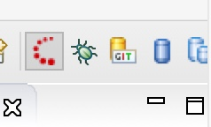
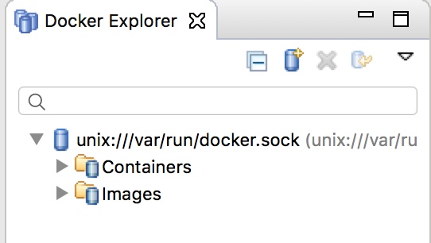
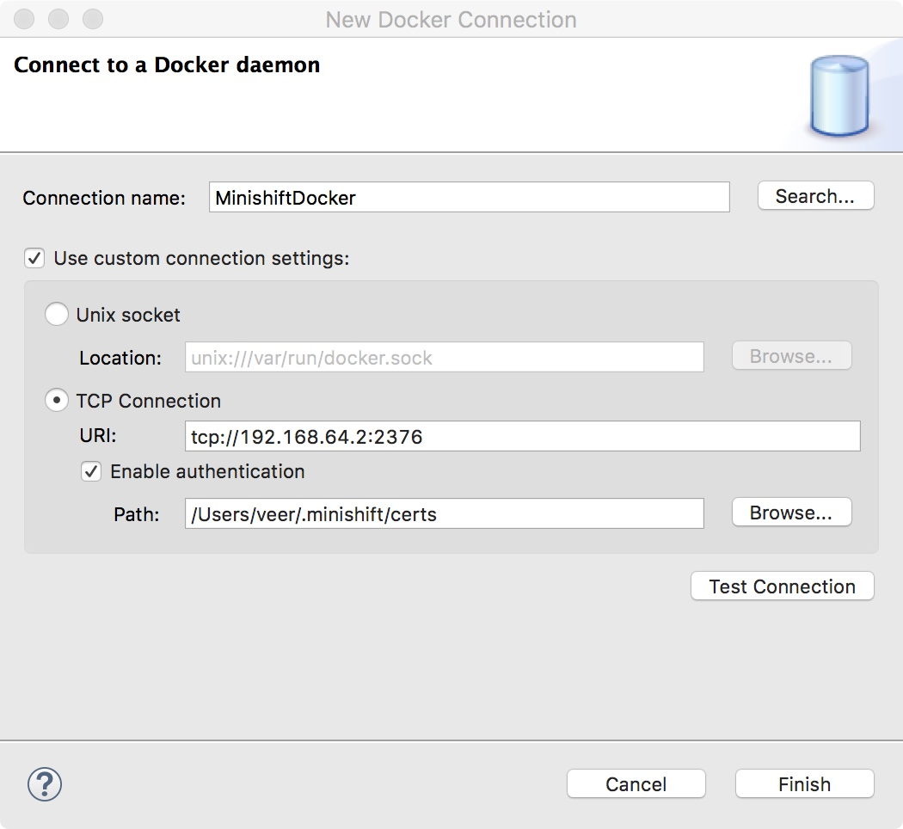
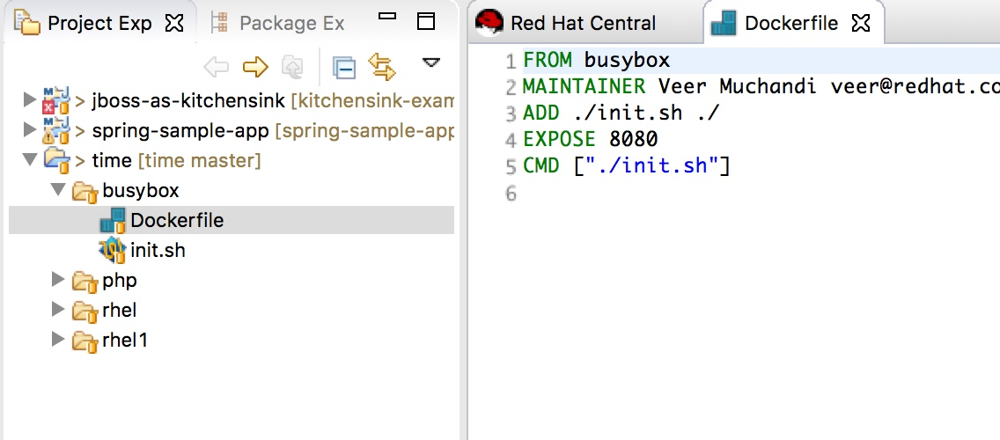
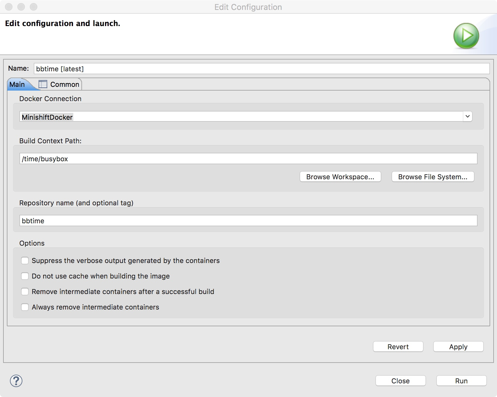
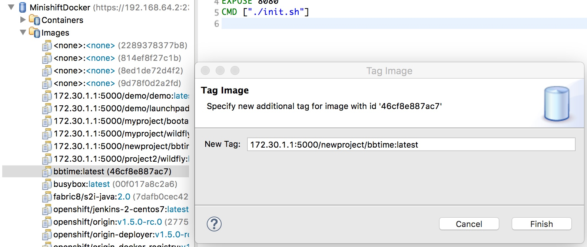
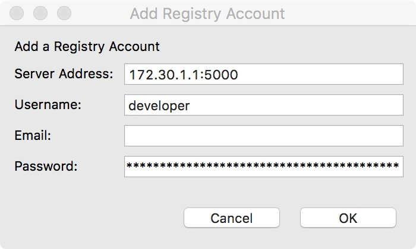
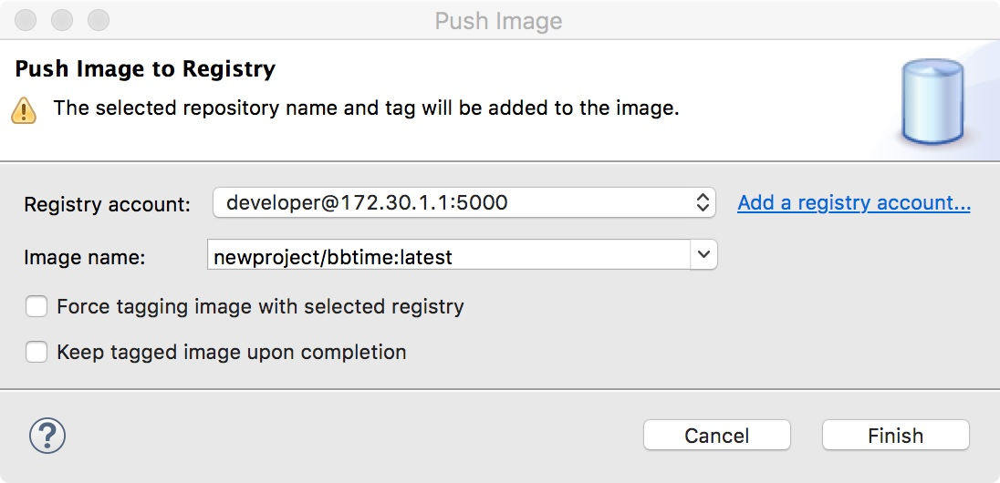
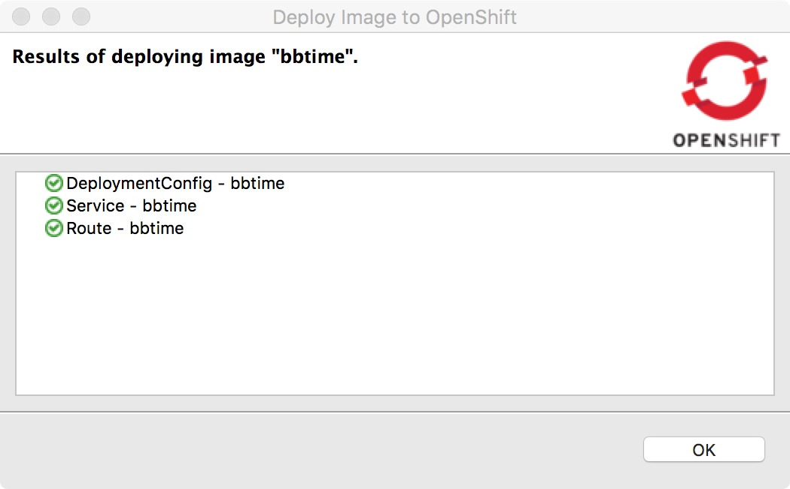

## Building and Deploying Container Images Using JBDS

**Use Case:** As a developer, I wish to create container images using JBDS and deploy them to OpenShift

**Step 1:** Switch to Docker perspective 		
On the top right of JBDS you will find icons to switch perspectives. Find the `Docker Tooling` icon that appears as a single blue cylinder. If you hover over the icons it should show the label `Docker Tooling`. You can also open this by going through menu options `Window`->`Perspective`->`Open Perspective`->`Other` and select `Docker Tooling`.




**Step 2:** Create a connection to the Docker Daemon running on the Minishift VM

Minishift runs a VM, and a docker daemon inside that VM. `oc cluster up` that is run by minishift pulls the OpenShift all-in-one and instantiates using this docker daemon. While you may have Docker running on your workstation (example Docker on Windows or Docker on Mac), Minishift doesn't use that daemon. In this step, we will connect to this daemon from JBDS.

* To find the connection details run the following command from your command line to gather minishift's docker connection details.

```
$ minishift docker-env
export DOCKER_TLS_VERIFY="1"
export DOCKER_HOST="tcp://192.168.64.2:2376"
export DOCKER_CERT_PATH="/Users/veer/.minishift/certs"
export DOCKER_API_VERSION="1.24"
# Run this command to configure your shell: 
# eval $(minishift docker-env)
```

Note the values for `DOCKER_HOST` and `DOCKER_CERT_PATH`. In my case they are 
`tcp://192.168.64.2:2376` and `/Users/veer/.minishift/certs`

* In the `Docker Explorer`, press on the `Add Connection` icon (blue cylinder with a yellow + sign). 



* This will open up `Connect to docker daemon` window. Now provide a `Connection name` and type in the connection parameters noted above for `TCP Connection`. Check `Enable Authentication` and provide the `DOCKER_CERT_PATH` noted above. 



* Press on `Test Connection` to ensure that the connection is successful. Then press on `Finish`

* `Docker Explorer` view on the left should now show the connection that you just created.  Expand the same and navigate through the `Images` and `Containers` to get accustomed to this view.

**Step 3:** Create an Application Container Image

We will use a Dockerfile to create a container. I have a simple example here [https://github.com/VeerMuchandi/time](https://github.com/VeerMuchandi/time) that has a Dockerfile based on busybox as the base image. If you are using Minishift with CDK, you can use rhel based image.

* Let us switch back from the `Docker tooling` perspective back to `JBoss` perspective by clicking on the red dots icon.


* Right click in the `Project Explorer` view and select `Import`->`Import`. Choose `Git` and `Projects from Git (with smart import)` and the `Next` button
* You'll see `Select Repository Source` window. Choose `Clone URI` and press `Next` again
* Next you'll see `Source Git Repository` window. Copy paste [https://github.com/VeerMuchandi/time](https://github.com/VeerMuchandi/time) in the `URI` and press on `Next` and again `Next` in the `Branch Selection` window
* Choose a directory for `Local Destination` or leave it as defaults and press `Next` and Finish on the next window.

This will import the git repository with code and make it available via `Project Explorer`. We are interested in the `Dockerfile` in the `busybox` folder. Open the same.


* Now let's switch back to the `Docker Tooling` perspective
* Right click on the `Dockerfile` and select `Run As`->`Docker Image Build`
* You'll see `Edit Configuration` window. Give a `Name:` to the image (I called it `bbtime`) and select the `Docker Connection` to point to the Minishift daemon that you configured earlier. Ensure the `Build Context Path` is set correctly and press on `Run`

* The docker build should now start and you will see the output in the `Console` view at the bottom
* Now use `Docker Explorer` and navigate to `Images` in the Minishift Docker Daemon that you configured earlier. You should find the new image that you just created (`bbtime`) there.

**Step 4:** Deploy the container image into OpenShift

In order to deploy this image we will tag it and push it into the openshift internal registry first.

* Go to `OpenShift Explorer` view at the bottom and find the OpenShift connection to the Minishift Cluster. This OpenShift connection should show `My Project`. Right-click on the OpenShift Connection and choose `New` -> `Project`. Provide a name for the project. I'll call it `newproject` and give a `Display Name` of `My New Project` and press on `Finish`.
JBDS will create a new project on the OpenShift cluster. We will use this project to deploy our application using the container image.

* Based on what you learnt in chapter 2, you know how to find the registry service IP. Usually it is set to `172.30.1.1` by default and exposes port `5000`. Let's now retag the image as `172.30.1.1:5000/newproject/bbtime:latest` where `172.30.1.1:5000` is the container registry running on OpenShift and `newproject` is the namespace.
In the `Docker Explorer` view select the image (`bbtime`) created in the previous step, right-click on the same and `Add Tag`. Fill the `New Tag` fied with the value `172.30.1.1:5000/newproject/bbtime:latest` and press `Finish`.


* Our next step is to Push this tagged image. Find the image with tag `bbtime:latest` in the images list and right click on it and select `Push`. You will be taken to `Push Image` window. Use `newproject/bbtime:latest` for `Image Name`.  We will need token from `oc login` to use as password here. So go to command line and run `oc whoami -t` to find the token. Fill in  `Server Address` with the registry address i.e `172.30.1.1:5000`, and Username as `developer` and use the token as the `Password`. Then press on `Finish` to push the image to atomic registry on OpenShift.






* If you check now in the new-project, you should see the image stream in place

```
$ oc project newproject
Now using project "newproject" on server "https://192.168.64.2:8443".
$ oc get is
NAME      DOCKER REPO                         TAGS      UPDATED
bbtime    172.30.1.1:5000/newproject/bbtime   latest    4 minutes ago
```

* In order to deploy the application, navigate to the `Docker Explorer` view,  right click on the `172.30.1.1:5000/newproject/bbtime:latest` in the images list and select `Deploy to OpenShift`. 
* You'll see `Deploy an Image` window. Make sure that you are using the `newproject` and `Image Name` is pointing to `172.30.1.1:5000/newproject/bbtime:latest` and press `Next`
* Click `Next` again twice to accept the defaults on the `Deployment Configuration` and `Service and Routing Settings` windows
* On the next screen let's add a label `app=bbtime` and press on `Finish`. This will deploy the docker image as a new application.



* Now if you go to `OpenShift Explorer` view and navigate to `newproject` you should see the `bbtime` service running. Right click on the service and `Show In` -> `Web Browser` to view the running application.


**Summary:** In this chapter, we learnt to set up connection to a docker daemon running on minishift from JBDS. Then built a container image on JBDS, tagged and pushed it into an OpenShift project to create an image stream. Then we deployed the application into this project. 


