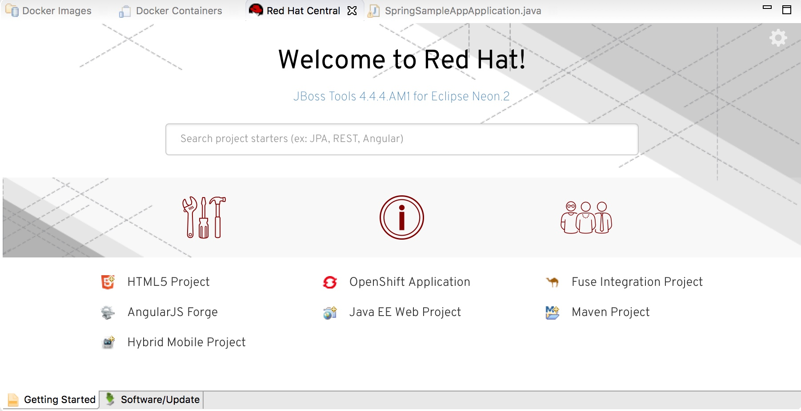
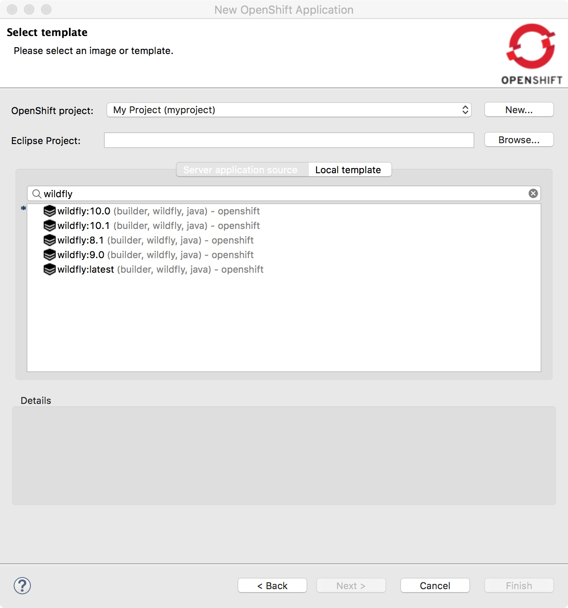
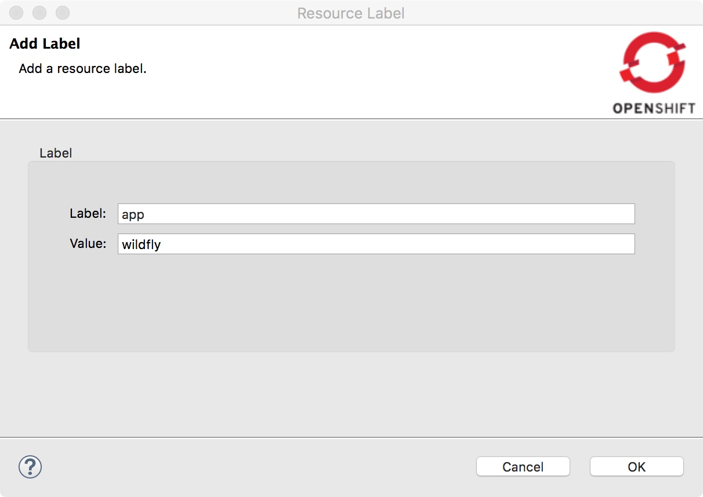
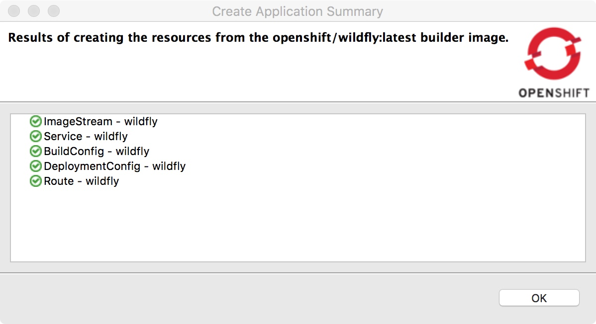
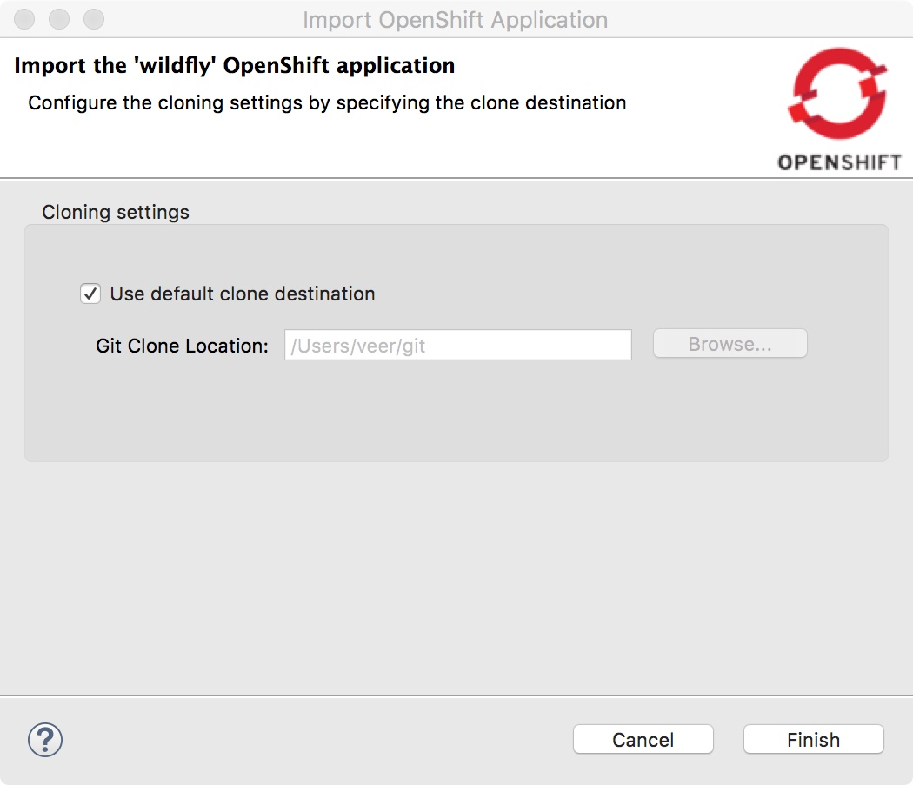
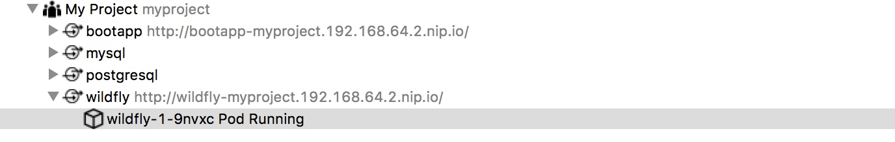
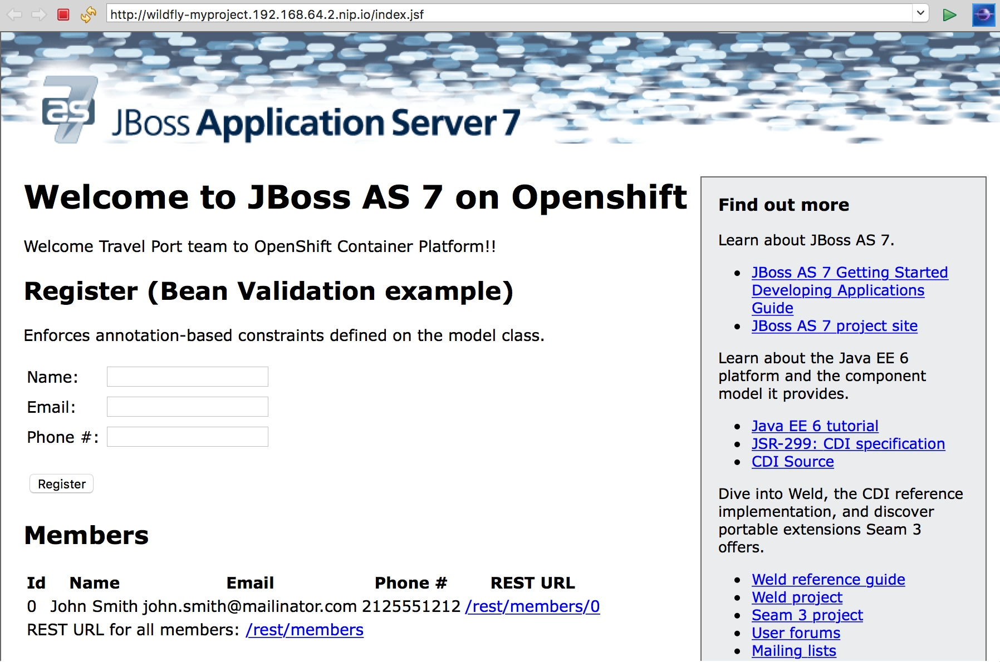

## Create an Application from JBDS

**Use Case:** As a developer, I want to deploy an application into an OpenShift cluster from an IDE.

* Select `OpenShift Application` from Red Hat Central. Alternately you can also right click on `Project Explorer` view and select `New`->`Project`->Select `OpenShift` Wizard-> `OpenShift Application`

* If you worked through the previous chapter, the connection information to Minishift should up on the `Sign in to OpenShift` window. If not, add a connection. Click `Next`

* We will add an application that uses Wildfly. On the `Select template` window, `type filter text` to search for `wildfly` and choose `wildfly:latest`

* `Build Configuration` page will be displayed. Fill in this Git repo link as the value for Git URL [https://github.com/VeerMuchandi/kitchensink-example](https://github.com/VeerMuchandi/kitchensink-example). Press on `Next` three times to accept the defaults for build and deployment configuration. It will take you to `Resource Labels` screen. 

* Let's add `app=wildfly` as the label as shown below and press on `Finish`

* You will see a `Results` window that shows all the resources created on OpenShift. Press `OK`

* Now you will `Import` application window that will pull the source code to your local machine. Choose the `Git Location` or leave it as default and press on `Finish`

This will import source code and update maven repositories. This may take a few minutes to complete. Now you will see `jboss-as-kitchensink` project in the `Project Explorer` view.

You will also notice that the application named `wildfly` will be build and deployed in a few minutes. 

**Bonus Points** Watch the build logs while the build is running and pod logs after the pod comes up.

* The `OpenShift Explorer` should show running application as shown below. 
  

* Now Right-click on the wildfly service and show in browser. You should see kitchensink deployed and running

**Summary:** In this chapter you have learnt to deploy an application to an OpenShift cluster using IDE.

