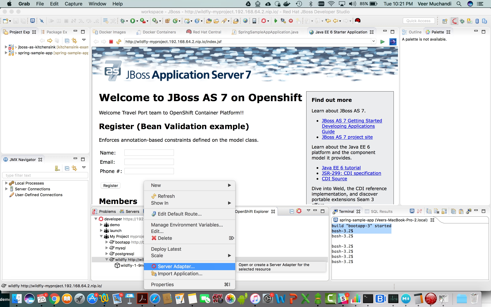
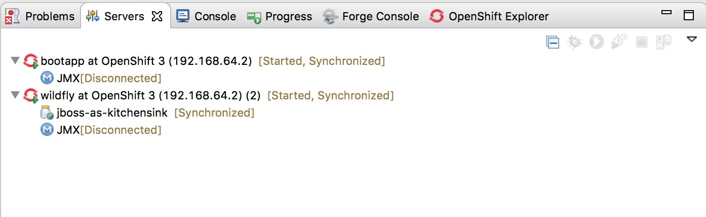
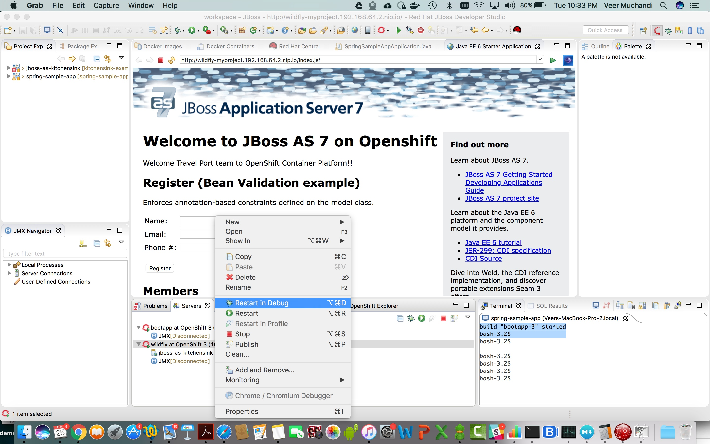
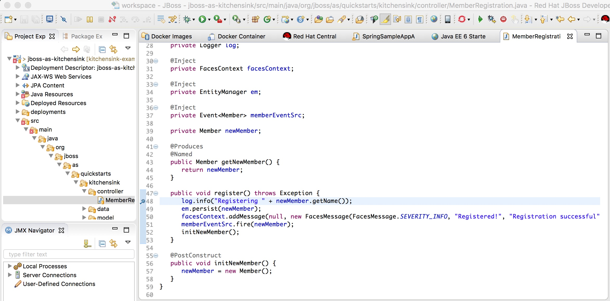
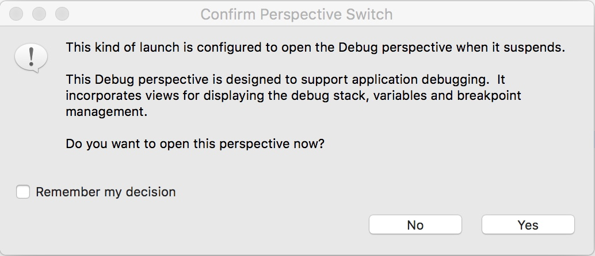

## Debugging your local application using IDE

**Use Case:** As a developer, I want to do step-by-step debugging of an applicaton running as a pod on the OpenShift cluster using IDE.

Application Debugging is explained in detail in this [blogpost](https://developers.redhat.com/blog/2016/08/26/using-red-hat-jboss-developer-studio-to-debug-java-applications-in-the-red-hat-container-development-kit/). We will cover the required steps shortly in this chapter. Please read the blog at your convenience for detailed overview on debugging using JBDS.

**Step 1** Create Server Adapter	
Server Adapter synchronizes the content between the running application and the workspace.

* Go to the `OpenShift Explorer` view and right click on the `wildfly` service and select `Server Adapter` to create the server adapter for the `wildfly` application service

* Next you will see `Server Settings` page. Ensure that the `Eclipse Project name` matches what you see in the `Project Explorer` view i.e. `jboss-as-kitchensink` and press `Finish`. You will quickly start seeing Console output that shows the syncup between the pod and the workstation. Once complete you should see `wildfly at OpenShift` on the `Servers` view. 

The Server adapter is now created and ready to use.

**Step 2:** Set up Server adapter for debugging

* On the `Servers` view, right click on the `wildfly at OpenShift 3` and select `Restart in Debug`. 

This will stop the current application pod and start a new one with debugging features. It will take a few seconds for it to come up. So, you can observe the pod going down and the new one coming up. When the new pod starts, the `Servers` view will show that the adapter is running in `Debugging` mode

* Go to the `OpenShift Explorer` view, right click on `wildfly` service and select `Manage Environment Variables`. You can observe that the debug variables are all set automatically.
 

* Open `MemberRegistration.java` in controller from source code and double-click on the line inside the `register()` method to insert a breakpoint as shown below.

Now we are ready to start debugging.

**Step 3** Start debugging	

* Access the application URL in the browser
* Add values for `Name`, `Email` and `Phone #` and press on the `Register` button on the application webpage.	
* JBDS will ask you to switch to `Debug` perspective. Press `Yes`

* The control now stops at the breakpoint. You can do step-by-step debugging now.

Once complete, you can switch back to the JBoss perspective. You can also `Restart` the Server adapter in the normal mode.

**Summary:** In this chapter we have learnt to debug an application running on OpenShift using IDE. 

