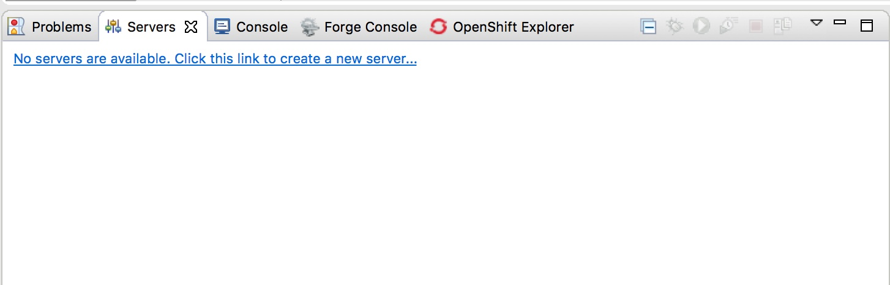
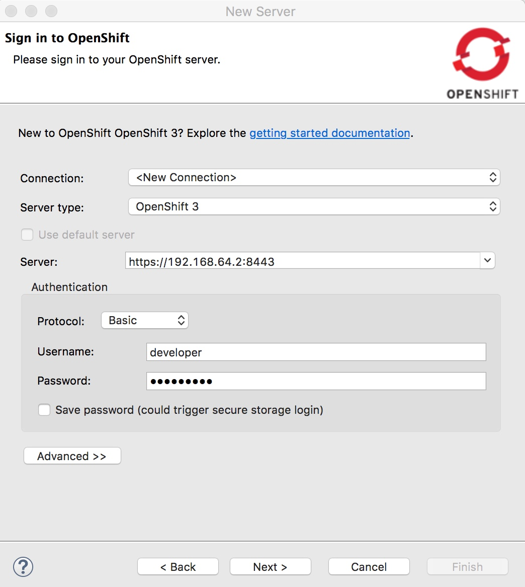
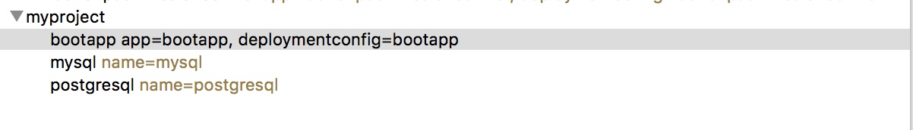
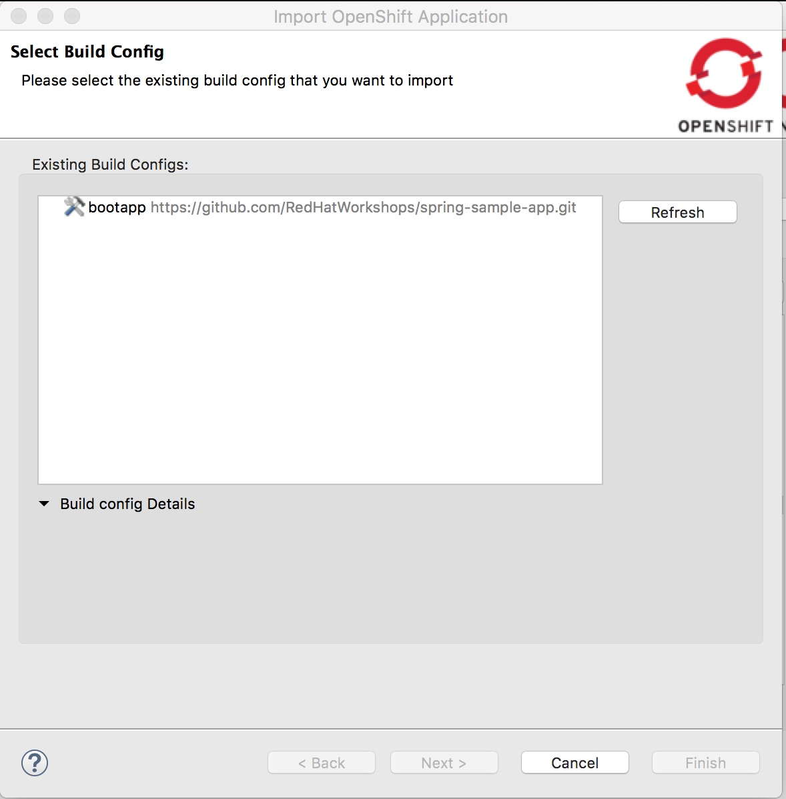
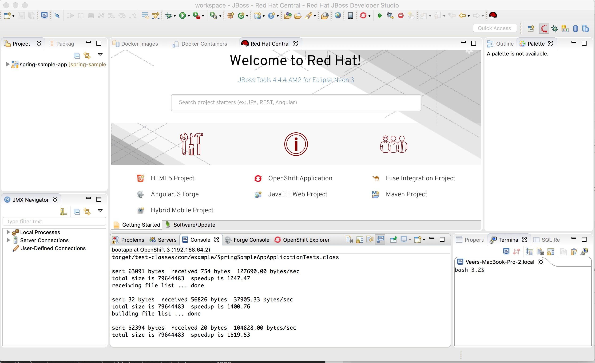

## Setting Up JBoss Developer Studio

**Use Case:** As a developer, I want to use an IDE for application development while using the local OpenShift cluster. I need seamless connectivity from the IDE to my local OpenShift environment.

**Step 1:** Install JBoss Developer Studio

Download and install JBoss Developer Studio following the installation instructions from here [https://developers.redhat.com/products/devstudio/download/](https://developers.redhat.com/products/devstudio/download/). You will need to register with [https://developers.redhat.com/](https://developers.redhat.com/) to be able to download.

**Step 2:** Connect JBDS to the Local OpenShift Cluster

* Open JBoss Developer Studio	
* Go to the `Servers` tab at the bottom and `click on the link to create a new server` 

* Select `OpenShift 3 Server Adapter`, you can leave the Server's host name as `localhost` and click `Next`

* On the next page sign into the OpenShift server. Here you would use the Minishift Master URL and credentials (`developer/developer`)

* Click on `Next` and it will prompt you about `Untrusted Server Certificate`. Accept the same pressing on `Yes` button. Now OpenShift Cluster will be added to your servers list. 

**Step 3:** Import the previously added service into Eclipse.

* On the next window, select `bootapp` service in the services window and click on the `Import` button next to Eclipse Project field.

* You should now see `bootapp` under Select Build Config. Choose that and click on `Next` button. 

* On the next page, choose a Git Location of your choice or leave it as default and press on `Finish`

Now the `spring-sample-app` will be imported into your JBDS. You will find it under the `Project View` as shown below.

Congratulations!! We are now connected to the application running on Minishift from the IDE.

