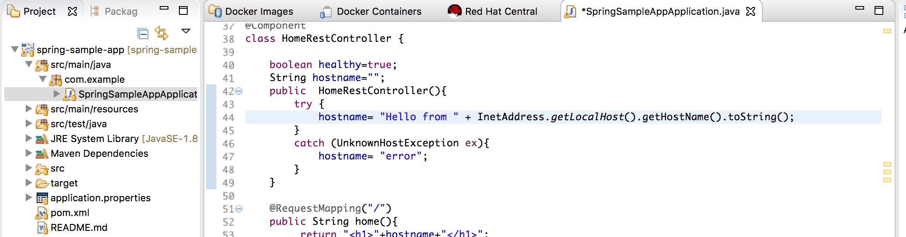
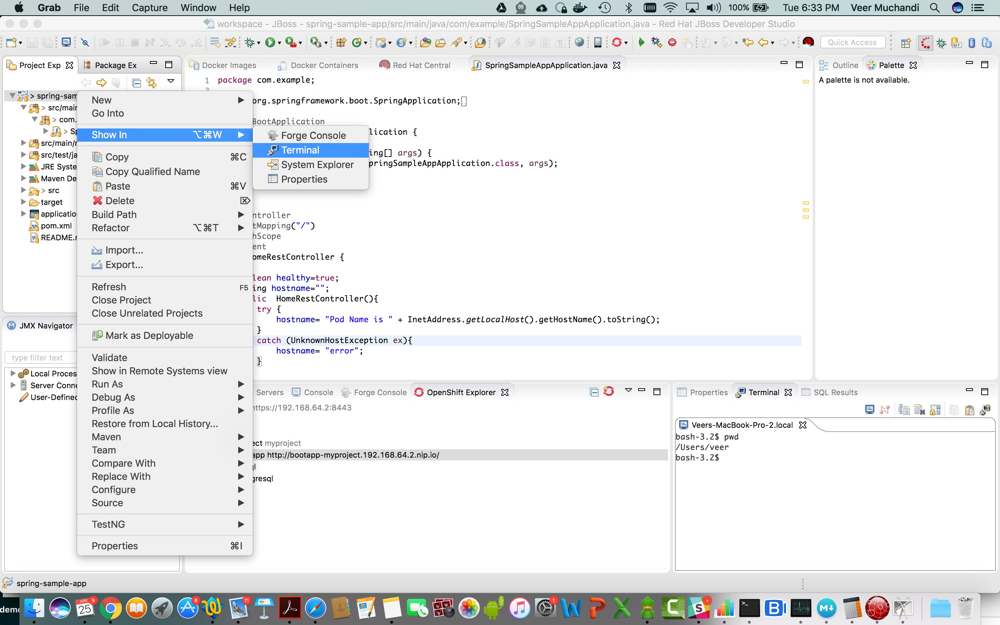
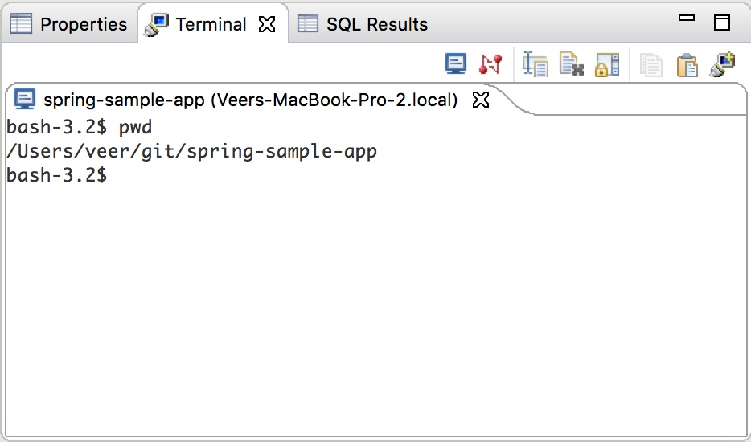
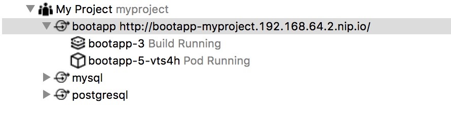
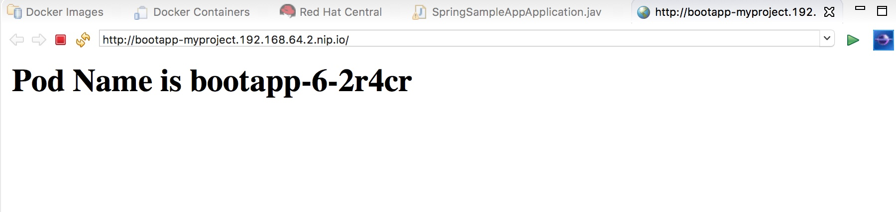

## Making changes using JBDS and testing locally

**Use Case:** As a developer, I want to make code changes via IDE and deploy to my local OpenShift cluster. I do not want to commit code changes to the source control repository until I am satisfied with my changes being tested locally the OpenShift cluster.

**Prerequisite:** While you can deploy an application from scratch using an IDE, this chapter assumes that you have deployed the `boot-app` application in the previous chapter and build over that. So if you are following step-by-step instructions in this chapter, the prerequisite is to complete the chapter named [Change Application and Test Locally](ChangeApplicationAndTestLocally.md).

* Navigate to `src/main/java/com/example/SpringSampleAppApplication.java` from the Project Explorer.




* Edit the text `Hello from` to your own text. Let's say, we will change it to  `Pod Name is`. Click on the save button on the top to save the changes.

**Note** The application was previously deployed from github. Here we made changes to the code but did not commit and push those changes to the git repository. We intend to test the changes before we commit them to the git repository.

* Right click on `spring-sample-app` in the Project Explorer and choose `Show In` and `Terminal` as shown below



* You will see a terminal window and you are inside the project folder as shown below. 



* Now let us login to our Minishift cluster from this terminal window

```
bash-3.2$ oc login https://192.168.64.2:8443
Authentication required for https://192.168.64.2:8443 (openshift)
Username: developer
Password: 
Login successful.

You have access to the following projects and can switch between them with 'oc project <projectname>':
 
    * myproject

Using project "demo".
bash-3.2$ 


```

* And start the build

```
bash-3.2$ oc start-build bc/bootapp --from-dir=.
Uploading directory "." as binary input for the build ...
build "bootapp-3" started
bash-3.2$ 
```

* If we navigate to the OpenShift Explorer view now, we will find the build pod running. You can look at the build logs by right clicking on the pod and selecting `Build Log` and the logs will show up.



* In a few mins the build should complete and the newer version of `boot-app` application should be deployed. 

* Now right-click on `My Project` and select `Show In`-> `Web Browser`, you should see your application with changes.



**Summary:** In this chapter we have learnt to make changes from IDE and test them without committing the changes to a git repository. You can commit the changes to your personal git repo if you like.


